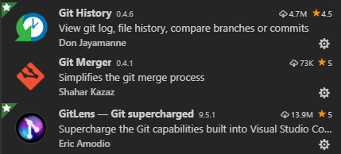

# GUÍA DE GIT

##### Índice  
- [Instalar git](#instalar-git)
- [Configurar usuario](#configurar-usuario)
- [Clonar repositorio](#clonar-repositorio)
- [Crear rama](#crear-rama)
- [Commit](#commit)
- [Subir cambios](#subir-cambios)
- [Bajar cambios](#bajar-cambios)
- [Unir ramas](#unir-ramas)
- [Archivo gitignore](#archivo-gitignore)
- [RESUMEN](#resumen)
- [Fuentes](#fuentes)


## Instalar git

Primero deben instalar git: [Descargar instalador para Windows](https://git-scm.com/download/win). Esto les permitirá usar git desde la consola de comandos.

También pueden usar SourceTree, que les ayudará a visualizar mejor los commits y las ramas.

En Visual Studio Code recomiendo instalar las siguientes extensiones:




## Configurar usuario


Para poder trabajar en un repositorio, se debe ser un usuario autorizado para trabajar en él.

Para ello configuraremos el nombre de usuario y email globales de git con los siguientes comandos:

```bash

git config --global user.name "Rosita Hormann"

git config --global user.email rosita.hormannlobos@gmail.com

git config --global user.password "*******************"

```

Configurar el nombre de usuario en realidad no es necesario, pero ayuda a mantener bien documentado los commits que se realizan.

No olvidar que el correo deben coincidir con el correo de la cuenta de Gitlab, lo mismo para la contraseña.

La contraseña tampoco es tan necesaria pero si no la ponen se las va a pedir cada vez que hagan pull, push y otros comandos, lo cual puede ser un poco cansador.

Para revisar que hayan puesto bien los datos, pueden correr el siguiente comando:

```bash

git config --list

```


## Clonar repositorio

Deben primero ubicarse en una carpeta, por ejemplo yo guardo mis repositorios de la U en una carpeta llamada _C:\repos\UCN_, y desde ahí abrir la consola de comandos. En windows pueden abrirla manteniendo apretado ctrl y luego boton derecho del mouse, y asi les va a salir la opción de abrir Power Shell.

Para clonar un repositorio basta con correr el siguiente comando:

```bash

git clone path/to/repository

# En nuestro caso hay que usar como path/to/repository el link del repositorio:

git clone https://github.com/lil-rose/guia-git.git

```
Luego de correr el comando se debería crear la carpeta con el nombre del proyecto.

Si ese comando no les funciona, creen una carpeta con el nombred el proyecto, y dentro de ella corran estos tres comandos:

```bash

git init

git remote add origin git@<NOMBREUSUARIO>.github.com/lil-rose/guia-git.git
# reemplazen <NOMBREUSUARIO> por el nombre de usuario de su cuenta de github.

git pull origin master


```


## Crear rama

Una vez hayan clonado el repositorio, deben saber que el proyecto tendrá dos ramas principales: "master" y "develop".

La rama **master** es una rama que debe mantenerse intacta excepto para motivos especiales (que sinceramente desconozco).

La rama **develop** es una rama que se usa para mantener el avance (desarrollo, development) del proyecto. Es importante que jalen (pull) esta rama antes de ponerse a trabajar:

```bash

git pull origin develop

## origin --> se refiere al link de donde clonamos el repositorio. Conceptualmente es lo mismo que "remote"
## develop --> nombre de la rama que queremos copiar en nuestro local, en este caso develop.

```


Finalmente deben saber que, para trabajar más ordenado y evitar conflictos, **cada integrante** o conjunto de integrantes **debe trabajar en su propia RAMA (branch)**.

Una rama se crea con el siguiente comando:

```bash

git checkout -b nombre_rama

```

Lo ideal es que el nombre de la rama coincida con la funcionalidad que van a desarrollar.

Por ejemplo, si se está realizando la funcionalidad de generar informe de calidad, un nombre de rama podría ser: _informe_calidad_. Lo importante es que sea descriptivo.

Si se desea consultar las ramas locales existentes y la rama en la que se está parado en este momento, basta con ingresar el siguiente comando:

```bash

git branch

```

Cuando hayan terminado una funcionalidad, deben subir la rama al remoto (ver secciones **Commit** y **Subir cambios**).

Luego para seguir trabajando deben cambiarse a la rama develop:
```bash

git checkout develop

```

Y desde ahí deben actualizar los datos que estén arriba ( ver sección **Bajar cambios**).

Finalmente desde develop crean la nueva rama para la siguiente funcionalidad:

```bash

git checkout -b otra_funcionalidad

```

La idea es que la funcionalidades de cada rama no sean codependientes, así se podrá mantener modularizado el objetivo de cada rama.

Ahora bien, si están trabajando en equipo y en cierto punto del desarrollo se hace necesario que dos personas trabajen en funcionalidades codependientes al mismo tiempo, necesitarán hacer lo siguiente:

Por ejemplo está funcionalidad "b", que depende de la funcionalidad "a". Crear la rama a partir de la rama "a" en vez de la rama develop:

```bash

git checkout funcionalidad_a # Si ya existe en su local, sino deben primero crearla y luego pullearla del origen.

git checkout -b funcionalidad_b # Ahora funcionalidad_a será un subconjunto de funcionalidad_b.

```

Finalmente cabe destacar que no es recomendado que una misma persona trabaje en más de una rama a la vez. Primero debe terminar la funcionalidad de su rama y ahí recién pasar a otra funcionalidad y hacer otra rama para ella.


## Commit

Commit es la acción de añadir los cambios al historial de la rama, es como hacer un "guardar cambios de la rama", se traduce como "perpetrar" (es decir, **hace los cambios permanentes**).

Para perpetrar los cambios que tengan en su local, deben hacer estos comandos:

```bash

git add . # Esto añadirá todos los cambios que hayan realizado desde el último "add", lo cual incluye: archivos editados, eliminados y creados.

git commit -m "mensaje de commit" # Es recomendable que el mensaje de commit sea lo más breve posible, pero a la vez lo más descriptivo posible.

```

OJO: Hacer commit no subirá los cambios al repositorio remoto. Se pueden hacer tantos commits como se desee para ir guardando historial y progreso de forma local.

Para revisar los commits que tienen guardados en el local, basta con ingresar este comando:
```bash

git log

git reflog # lo mismo pero más detallado.

```

Recuerden: Local es lo que está en su copia del repositorio que tengan en el PC, NO en el repositorio remoto (o de origen).

También pueden revisar el historial con la extensión _**Git History**_ de _Visual Studio Code_.


## Subir cambios

Para poder subir los cambios, la zona de trabajo (working directory) debe estar limpia, es decir, deben hacer hecho "add" y "commit" de todos los cambios que hayan hecho.

Si no están seguros de que hayan guardado todos los cambios, pueden revisar con el siguiente comando, que les mostrará qué cambios no han subido (y también les dirá el nombre de la rama donde están).

```bash

git status

```

Si el working directory está limpio, les saldrá: "Working directory clean, nothing to commit".

Para subir sus cambios deben hacer el siguiente comando:

```bash

git push origin nombre_rama

```

Donde nombre_rama coincida con el nombre de la rama en la que han estado trabajando.


## Bajar cambios

Si quieren bajar en su local los cambios que otra persona haya realizado en una rama (por ejemplo: otra_rama), primero que nada deben "crear esa rama" (da lo mismo que ya exista en el remoto).

```bash

git checkout -b otra_rama

```

Luego deben "jalar" (pull) los cambios que estén en esa rama en el remoto.

```bash

git pull origin otra_rama

```

Lo más probable es que esto lo hagan solamente con la rama "develop" a menos que sea estrictamente necesario hacerlo con la rama de un compañero, como explicaré en la sección **Unir ramas**.


## Unir ramas

Cada desarrollador debe crear sus propias ramas y mantenerlas actualizadas en el remoto. Junto con esto, la rama develop debe actualizarse en cada iteración del proyecto para mantener actualizado el estado de avance del equipo en una sola rama que represente todo el desarrollo.

También probable que en su equipo necesiten en algún punto compartir información entre ustedes de forma inmediata. Por ejemplo, la "rama_A" necesita adquirir los cambios que se hayan realizado en la "rama_B" (o en la rama "develop" que será lo que normalmente ocurra)

Primero deben jalar la rama_B (ver sección de "Bajar cambios").

Luego deben ubicarse a la rama_A usando el comando:
```bash

git checkout rama_A

```

Finalmente deben "unir" o mezclar (merge) la rama_A con los cambios de la rama_B
```bash

git merge --no-f rama_B

```

Cuando hagan esto, si en la rama_B se editaron los mismos archivos que se han estado editando en la rama_A, es altamente probable que git no pueda unirlos por su cuenta y les va a salir un mensaje: "Se han encontrado conflictos" (lo cual es un comportamiento esperable).

Usando el editor _Visual Studio Code_ busquen lo archivos que se han marcado como "con conflicto" (se marcan con una **C** de color morado a la derecha del nombre), abren el archivo y resuelvan los conflictos. Es bastante intuitivo pero si tienen problemas haciéndolo me pueden preguntar, pero en resumen tienen que elegir si aceptan los cambios de la rama actual, los cambios de la rama que se está tratando de mezclar con la rama actual, ambos cambios o ninguno.

Lo otro es que, si la rama_A y la rama_B tienen distintos autores, es conveniente que el proceso de resolver conflictos lo hagan entre los dos ó al menos consultando al compañero los cambios que haya realizado en su rama, para evitar perder cambios importantes.

## Archivo gitignore

Podrán notar al abrir el proyecto que se ha añadido un archivo llamado _.gitignore_, que tiene más o menos esta estructura:

```
node_modules
package-lock.json
package.json
TODO
.vscode/
archivosdeprueba/

```

Este archivo contiene todos los directorios y archivos que serán ignorados al hacer cualquier comando de git (add, commit, push, pull y clone).

Si están haciendo un proyecto entre pocas personas, un proyecto personal o un proyecto pequeño quizá no necesiten usarlo, pero en caso de que quieran poner su propia carpeta de archivos para probar cosas pueden usar este archivo para evitar subir esos cambios al remoto (es una buena práctica).


## RESUMEN

|**Comando**|**Descripción**|
|---|---|
|_git clone path/to/remote/repository_| Clonar un repositorio en tu local.|
|_git checkout -b branchName_| Crear nueva rama (localmente) y cambiarse a ella.|
|_git checkout branch_name_| Cambiarse a rama "branchName"|
|_git pull origin branchName_| Bajar cambios de branchName.|
|_git status_| Listar archivos con cambios que aún no se añaden o commitean.|
|_git add ._| Añadir todos los cambios hechos hasta el momento.|
|_git commit -m "message of commit"_| Hacer cambios permanentes y añadirle un mensaje |
|_git push origin branchName_| Actualizar rama en el remoto (subir cambios).|
|_git merge --no-f another_branch_| Mezclar rama en la que estás ubicado con another_branch.|


Agregar cambios de una rama (rama_A) a otra rama (rama_B) (o lo que es lo mismo, mezclar rama_A en rama_B):

````bash

git checkout rama_A     # Cambiarse a la rama "rama_A".

git pull origin rama_A  # Actualizar rama "rama_A".

git checkout rama_B     # Cambiarse a la rama en la que se desea trabajar y adquirir cambios de la otra rama.

git merge --no-f rama_A # Mezclar rama en la que se está trabajando con cambios de la rama develop.

````

Recuerden: NUNCA HACER MERGE SI ESTÁN UBICADOS EN LA RAMA DEVELOP a menos que sean el líder del proyecto y por tanto conozcan el nivel de avance del proyecto y de todos los miembros del equipo.


## Fuentes

Aquí listaré algunas fuentes en las cuales me basé para hacer esta guía.

- [Git reference](https://git-scm.com/docs): Documentación oficial.
- [Basic Git Commands](https://confluence.atlassian.com/bitbucketserver/basic-git-commands-776639767.html): Comandos básicos de Git.
- [Commit Message Guidelines](https://gist.github.com/robertpainsi/b632364184e70900af4ab688decf6f53): Guía para hacer mensajes de commit adecuados.
- [A successful Git branching model](https://nvie.com/posts/a-successful-git-branching-model/) Modelo eficaz de ramificación con Git.
- [Oh shit, Git!](https://ohshitgit.com/): Una página que muestra algunos ejemplos de errores extraños con su respectiva solución.

Les recomiendo encarecidamente leer [Basic Git Commands](https://confluence.atlassian.com/bitbucketserver/basic-git-commands-776639767.html).

Luego continúen la lectura con: [Commit Message Guidelines](https://gist.github.com/robertpainsi/b632364184e70900af4ab688decf6f53) y [A successful Git branching model](https://nvie.com/posts/a-successful-git-branching-model/).

 Si les surgen dudas pueden usar esta fuentes, buscar en internet su problema específico (casi siempre los problemas que tengan los podrán encontrar fácilmente) ó preguntarle a la autora de este proyecto.


